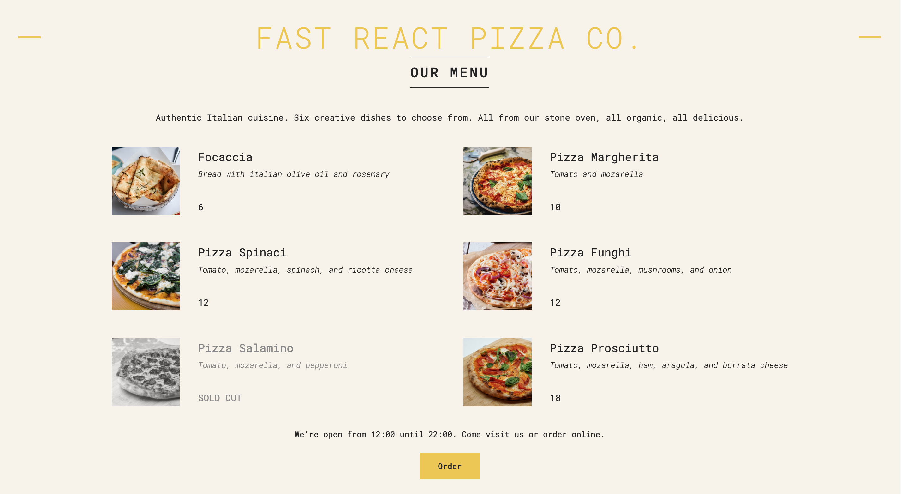
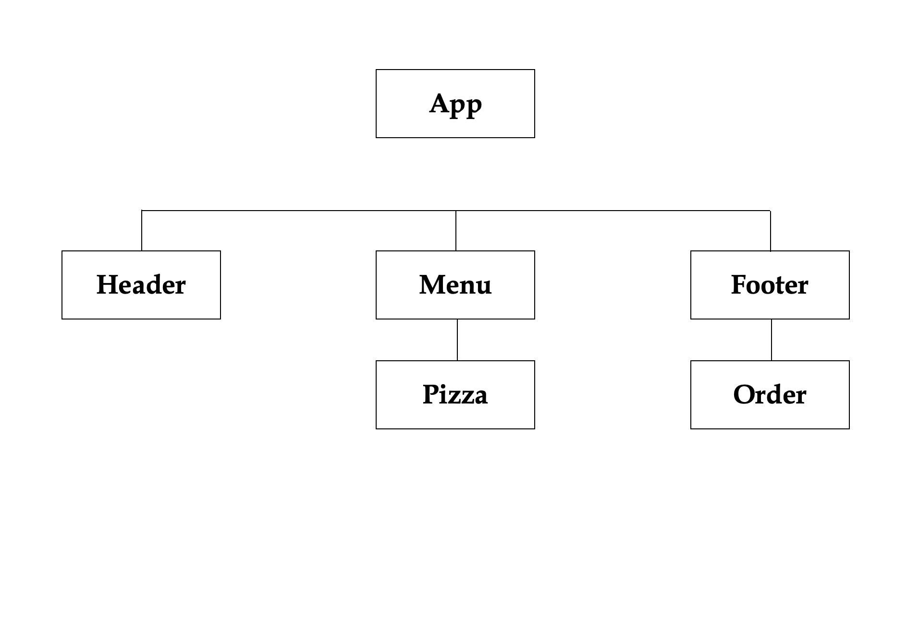

# **Fast React Pizza Co.**

The website of a fictitious pizza shop. 
This is the first walkthrough project in "The Ultimate React Course 2023: React, Redux & More" by Jonas Schmedtmann. 

## **1. Practiced Skills**

The goal of the project is to learn about React's very basics: components, props, and JSX.

## **2. Component Tree**

The app is comprised of a total of five components. Three of them are direct children of the app, namely:
- Header
- Menu
- Footer

In addition to these, two other components have been created, which are:
- Pizza, which is a direct child of the Menu; it loops through its related data array to render each pizza's image and information.
- Order, which is a direct child of the Footer; it renders the order button, available only during the shop's working hours.